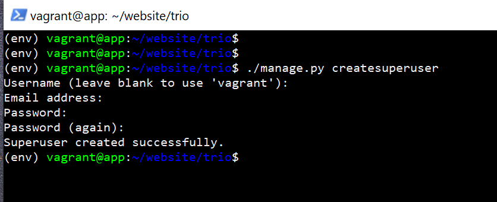

# 3-LAPP
Hi, I'm Juuso Vainikka and this is my mini-project for a configuration management course by Tero Karvinen (https://terokarvinen.com/2024/configuration-management-2024-spring/)

# Note

This version is not complete. It has problems here and there. This version does work, when following the guide at least when I've tested it. This is a module that requires troubleshooting skills if something doesn't work.

I won't be updating, fixing or finalizing this project for a little while. The reason for this is that on the day of writing this, I lost someone really really dear to me and I need time to heal. I have no motivation whatsoever to go further with this at the moment, so I hope you understand <3.

# The product

I've only tested this on a Windows host and using the vagrant-master functionality. The name "3-LAPP" means a 3-tier architecture with Linux, Apache, PostgreSQL and Python. You should have Vagrant, Hypervisor of your choosing (I recommend VirtualBox) and python (optional) installed and configured.

### Disclaimer! I am not to be held responsible for any damages or losses this module might directly or indirectly cause. Use it at your own risk.

## Business purpose

This module creates a test 3-tier test environment for learning, testing and development. This can be used to:

- Learn how things operate
- Find and patch vulnerabilities
- Try out new innovations
- Further developing the architecture

This can used in production after hardening it (making it secure) and modifying it to meet the needs of the business.

## The architecture

I created an image that should paint a visio about the architecture. The master machine should be here as well.

## License

I chose to use the GNU General Public License Version 3.

## Usage

Clone the repository and move into it. Then run the VagrantSetup script like so, or make do the setup manually. It essentially makes a directory inside and copies the needed files there. VagrantFile, app folder, db folder, universal folder, web folder, MasterSetup and top.sls should be inside the same directory. The script itself has a couple of lines of instructions so feel free to inspect it. Make sure you have Python installed if you are planning on using the scripts.

- Manual setup:
    - Make a new directory
    - Copy the files and folders stated above
    - Go to the newly created directory where you copied the files and folders.
    - use `vagrant up`

- Automatic setup:
    - run the script. Example -> `python3 ./VagrantSetup --vagrant-master`

After provision:

- Manual -> you are in the correct directory already. Just connect to the master `vagrant ssh master`

- Automatic -> Change directories to the correct directory and connect like so.

Once you are in, there should be the MasterSetup.py file inside the home directory where you landed. If for some reason it isn't there, then you can find it inside the /vagrant/ directory. Copy it over.

- Manual setup:
    - `sudo apt install ufw -y && sudo ufw allow 22/tcp && sudo ufw enable && sudo ufw allow 4505/tcp && sudo ufw allow 4506/tcp`
    - `sudo salt-key -A -y`
    - `sudo salt "*" test.ping`
    - `mkdir -p /srv/salt`
    - Copy the folders: web, app, db, universal to /srv/salt/ and copy the top.sls to /srv/salt. The files and folders have way too loose permissions inside the /vagrant folder so I recommend changing permissions.

- Automatic setup:
    - Run the script as with sudo. Example -> `sudo python3 MasterSetup.py --vagrant-master`

The script can be run again.

This is a know bug that happens most of the time when running the universal state or the highstate (top.sls) for the first time. The minions go down and the fastest way to continue would be to manually restart the minions. Open a new powershell and connect to the minions individually. Then run `sudo systemctl restart salt-minion.service`. Check the status after restart. They should be online. After this procedure I've not run into the same problem again. It is always the first run and after that everything just works, atleast in my case.

My recommended way of going on about this:
    - Run the universal state individually first. `sudo salt '*' state.apply universal`
    - Fix the problem by restarting the minions.
    - Then run the highstate `sudo salt '*' state.apply`

I wouldn't recommend running the highstate first cause this bug sometimes makes it look like nothing bad happened when in reality the states were run but not perfectly and the minions still crash.

Here I restarted the db minion's salt-minion.

After fixing the annoying bug, you can run the top.sls. If you followed my recommended way of running the universal state individually first, then there should be a lot of changes. In these screenshots, I didn't do like I recommend doing which resulted in some minor problems here and there.

If the highstate ran correctly, you should be able to open a browser of your liking and surf to 192.168.69.101. It warns you because the SSL certs are self signed. You can proceed anyway.

This is what you should see on the frontpage.

And this is what you should see at the admin panel since the static files haven't been moved yet. I you wanna access the site with example.com like in this picture, you need to add `192.168.69.101 example.com` in the hosts file. In linux this is in /etc/hosts in Windows it's in C:\Windows\System32\drivers\etc\hosts

One way of transferring these files is by using netcat like so:
- Make a hole in the firewall that is open to the app server.
- Then make netcat listen.
- Then in the app server send the files over.

Another fast way is by utilising the python http.server.
- In the app server, go to the /home/vagrant/website/trio/static directory and use `python3 -m http.server`.
- In the web server, use `wget 192.168.69.102/admin` to get the files. Remember to choose ports and make holes in the firewall accordingly.

Neither of these methods is encrypted, so if you don't want to transfer files in the clear, use a different tool like scp, sftp etc.

After you have transferred the files, the admin panel should look like this.

Then you can create a superuser in the app server.
- make your way to /home/vagrant/website
- use `source env/bin/activate`
- `cd trio/`
- `./manage.py createsuperuser`

Then you can log in.

I highly recommend changing the default password of the db user postgres and removing the last two states from the init.sls. You can change the password in the db server with ALTER USER postgres PASSWORD <'password'>. You need to connect to the db first with `sudo -u postgres psql`. Remember to update the django settings accordingly.

## Afterthoughts

I learned a lot while doing this project from SSL/TLS, integration, automation, troubleshooting to architectures etc. I chose this project mainly to learn these things and I'm proud to say that I learned a lot. Unfortunately I have no desire to continue at the moment because of reasons I already stated. I might continue this some other time in the future.

There's a lot of cmd.run use in my module. The reason for this is because the whole project is kinda broad and my thought process was like this:
- First manually
- Then the easiest way of making working IaC
- Lastly modify it to be better and more modern

So, the module is at the second phase you might say.

If you have questions, need help or you have something you would like to say, you can contact me here -> juuso.vainikka@outlook.com

Thank you for checking this out!

- Juuso Vainikka